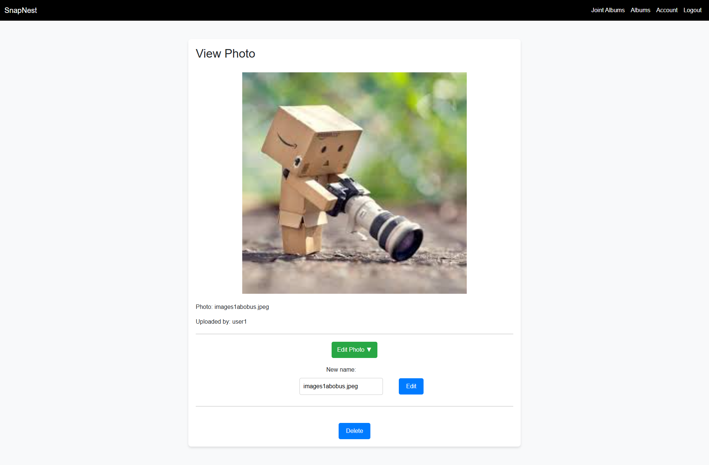

# SnapNestSpring

SnapNest is a modern platform for storing, organizing, and sharing photos. Users can create personal and group albums, customize access levels to images, and share content with friends and family. The system provides a high level of privacy and security, as well as convenient access from any device.

**Based on [SecureLoginSystemSpring](https://github.com/jabka1/SecureLoginSystemSpring), ensuring a robust and secure login & registration system**

<br>

## Deployment

The platform is currently deployed and running on **AWS EC2**. You can access the main page directly through the link below:

http://34.201.46.238:8080/mainPage

<br>

### ⚠️ Clipboard Restrictions on HTTP  

❗ **Attention!** Many modern browsers block access to the clipboard if the service uses HTTP and does not have an SSL certificate.  

🔴 This may cause problems with the copy link button to share a photo or album, which uses your clipboard, if you access the service via this link. Use the field next to where an existing link is already entered to share.

<br>

### ⚠️ Email Functionality (SMTP Sandbox)  

❗ **Attention!** The platform currently uses an **SMTP sandbox** for sending emails.  

🔴 Emails will **not be sent directly** to users but will instead be available in the sandbox via **MailTrap**.  

<br>

## Features
### User Account Features
- Change password and username
- Enable Two-Factor Authentication (2FA)
- Reset password if forgotten
- Login using Google account (OAuth2)
- Track failed login attempts (account locked for 60 seconds after 3 failed attempts)
- Account activation via email

### Personal Albums
- Create personal albums with the ability to nest albums within albums
- Rename photos and albums
- Delete photos and albums
- Set photos as either **public** or **private**:
    - **Public**: Can be shared with others
    - **Private**: Cannot be shared
- When sharing an album, only **public** photos will be visible, while **private** photos remain hidden

### Joint Albums
- Create **joint albums** with other users, based on role-based permissions:
    - **Owner**: Full control (edit content, add/remove users, change album name, modify roles, delete album)
    - **Read & Write**: Can upload, delete and rename photo
    - **Read Only**: Can only view photos
- Collaborate with others in a structured and secure way
- Email notifications when a user is added to a shared album


<br>

## Prerequisites
- Java 17 or higher
- MySQL 8 or higher
- Maven
- A MySQL database
- A Google reCAPTCHA API key (site key and secret key)
- An email service for sending emails (SMTP configuration)
- A Google Cloud Platform project with OAuth2 credentials for Google Login
- IAM on AWS
- AWS S3 Bucket
- AWS EC2 with created instance

<br>

## Technologies Used
- Spring Boot: Backend framework
- Spring Security: Authentication and authorization
- Thymeleaf: Template engine for UI
- Bootstrap & JavaScript: For Front-end
- MySQL: Database
- Hibernate: ORM framework
- BCrypt: Password hashing
- Google reCAPTCHA: Protection against bots
- JavaMailSender: Email service for account activation
- Jakarta Servlet API: For custom authentication handlers
- Google OAuth2: For Google Login integration
- UUID: To create a unique token to change the name of the photo in the storage
- Mailtrap: Service for creating SMTP sandboxes for sending emails
- Railway: Service for creating a remote MySQL database
- AWS S3 Bucket: Service for remote file storage
- AWS EC2: Service to create virtual servers in the cloud

<br>

## Installation

### 1. Clone the repository
```bash
git clone https://github.com/jabka1/SnapNestSpring
cd SnapNestSpring
```

### 2. Rename application.txt (src/main/resources/application.txt) to application.properties and fill your data
application.txt: [click here](src/main/resources/application.txt)

### 3. Configure the Database
Edit the application.properties file in src/main/resources:
```bash
spring.datasource.url=jdbc:mysql://YOUR_DB
spring.datasource.username=YOUR_USERNAME
spring.datasource.password=YOUR_PASSWORD
spring.datasource.driver-class-name=com.mysql.cj.jdbc.Driver
spring.jpa.hibernate.ddl-auto=update
spring.jpa.database-platform=org.hibernate.dialect.MySQL8Dialect
```
Replace YOUR_USERNAME, YOUR_DB and YOUR_PASSWORD with your MySQL credentials.

### 4. Configure Google reCAPTCHA
To integrate Google reCAPTCHA into your registration form, follow these steps:
- Go to the Google reCAPTCHA website https://www.google.com/recaptcha/about/.
- Register your site and get your site key and secret key.
- Add your secret key to the application.properties file:
```bash
google.recaptcha.site.key=YOUR_SITE_KEY
google.recaptcha.secret.key=YOUR_SECRET_KEY
```
Replace YOUR_SITE_KEY and YOUR_SECRET_KEY with your Google reCAPTCHA site keys.

### 5. Configure Email Activation
To enable email-based activation, configure the SMTP server in the application.properties file:
```bash
spring.mail.host=smtp.YOUR_EMAIL_PROVIDER.com
spring.mail.port=587
spring.mail.username=YOUR_EMAIL
spring.mail.password=YOUR_EMAIL_PASSWORD
spring.mail.properties.mail.smtp.auth=true
spring.mail.properties.mail.smtp.starttls.enable=true
```

Fill in your SMTP credentials.

### 6. Configure Google OAuth2 Login
To enable Google login, you need to set up OAuth2 credentials on the Google Cloud Platform:

- Create a new project in the Google Cloud Platform.
- Go to "APIs & Services" > "Credentials".
- Click "Create Credentials" and select "OAuth 2.0 Client IDs".
- Add your authorized redirect URI (http://localhost:8080/login/oauth2/code/google).
- After creating your OAuth2 credentials, note down your Client ID and Client Secret.
```bash
spring.security.oauth2.client.registration.google.client-id=YOUR_CLIENT_ID
spring.security.oauth2.client.registration.google.client-secret=YOUR_CLIENT_SECRET
spring.security.oauth2.client.registration.google.scope=profile,email
spring.security.oauth2.client.registration.google.redirect-uri={baseUrl}/login/oauth2/code/google
spring.security.oauth2.client.registration.google.client-name=Google
spring.security.oauth2.client.provider.google.authorization-uri=https://accounts.google.com/o/oauth2/v2/auth
spring.security.oauth2.client.provider.google.token-uri=https://oauth2.googleapis.com/token
spring.security.oauth2.client.provider.google.user-info-uri=https://www.googleapis.com/oauth2/v3/userinfo
```

Replace YOUR_CLIENT_ID and YOUR_CLIENT_SECRET with your Google Cloud Platform credentials.

### 7. Configure AWS IAM user creditionals and S3 Bucket

```bash
cloud.aws.credentials.access-key=YOUR_ACCESS_KEY
cloud.aws.credentials.secret-key=YOUR_SECRET_KEY
cloud.aws.region.static=us-east-1
cloud.aws.s3.bucket=YOUR_BUCKET
```
Fill in your AWS IAM user and S3 Bucket credentials.

### 8. Build the Project
Use Maven to build the project:
```bash
mvn clean install
```

### 9. Run the Application
Run the application using:
```bash
mvn spring-boot:run
```

### 10. Access the Application
Open your browser and navigate to:
```bash
http://localhost:8080
```

<br>

## Screenshots

### Main page


<br>

### Single user album

#### 1. Main album page


#### 2. Album in album


#### 3. Create album page


#### 4. Edit album page


#### 5. View public photo by user


#### 6. View private photo by user


#### 7. Share album page


#### 8. Share photo page


<br>

### Joint album

#### 1. List of joint albums


#### 2. Create joint album


#### 3. Joint album view for OWNER


#### 4. Joint album view for READ&WRITE


#### 5. Joint album view for READ_ONLY


#### 6. Edit album for OWNER


#### 7. Edit roles for OWNER


#### 8. Add users for OWNER


#### 9. Photo view for OWNER and READ&WRITE


#### 10. Photo view for READ_ONLY


<br>

### SMTP sandbox


<br>

### Error page


<br>
